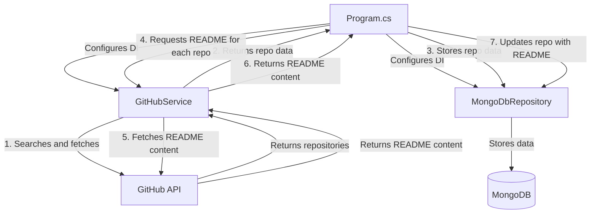

# RepoRanger

RepoRanger is a .NET application that searches for GitHub repositories based on configurable criteria, extracts their README content, and stores the repository metadata in a MongoDB database.

## Overview

RepoRanger helps you discover and archive GitHub repositories matching specific search criteria. It's designed to:

- Query the GitHub API for repositories matching keywords, language, star count, and date ranges
- Handle GitHub API rate limits with automatic retry mechanisms
- Extract and store README content for discovered repositories
- Persist repository data in a MongoDB database with upsert capability

## System Requirements

- .NET 8.0 SDK or later
- MongoDB server (local or remote)
- GitHub Personal Access Token with appropriate permissions

## Project Structure

```
RepoRanger/
├── src/                           # Source code directory
│   ├── RepoRanger.sln             # Solution file
│   └── RepoRanger/                # Main project directory
│       ├── Program.cs             # Application entry point and DI configuration
│       ├── GitHubRepository.cs    # Model representing a GitHub repository
│       ├── GitHubService.cs       # Service for interacting with GitHub API
│       ├── Repository.cs          # MongoDB repository interface and implementation
│       ├── Helpers.cs             # Utility methods for data conversion
│       ├── appsettings.json       # Configuration for GitHub API and MongoDB
│       └── RepoRanger.csproj      # Project file with dependencies
```

## Application Flow



## Setup and Configuration

1. Clone the repository
2. Navigate to the project directory
3. Update the `appsettings.json` file with your GitHub API token and MongoDB connection details:

```json
{
  "GitHubSettings": {
    "ApiToken": "YOUR_GITHUB_API_TOKEN",
    "Keywords": "your search keywords",
    "MinStars": 10,
    "ShowForked": false,
    "CreatedFrom": "2019-01-01",
    "CreatedTo": "2025-03-08",
    "Language": "C#"
  },
  "MongoDbSettings": {
    "ConnectionString": "mongodb://localhost:27017",
    "DatabaseName": "RepoRanger",
    "CollectionName": "Repositories"
  }
}
```

4. Build the project:
```bash
dotnet build
```

5. Run the application:
```bash
dotnet run
```

## Configuration Options

### GitHub Settings

| Setting | Description | Default |
|---------|-------------|---------|
| ApiToken | Your GitHub Personal Access Token | Required |
| Keywords | Search terms to find repositories | "fluentcms" |
| MinStars | Minimum number of stars a repository should have | 10 |
| ShowForked | Whether to include forked repositories | false |
| CreatedFrom | Start date for repository creation date filter | "2019-01-01" |
| CreatedTo | End date for repository creation date filter | "2025-03-08" |
| Language | Filter by programming language | "C#" |

### MongoDB Settings

| Setting | Description | Default |
|---------|-------------|---------|
| ConnectionString | MongoDB connection string | "mongodb://localhost:27017" |
| DatabaseName | Name of the database to use | "RepoRanger" |
| CollectionName | Collection name for storing repositories | "Repositories" |

## Features

- **Smart Search**: Automatically breaks down large result sets into smaller date ranges to work within GitHub API limits
- **Rate Limit Handling**: Detects and respects GitHub API rate limits with automatic waiting and retry
- **Duplicate Prevention**: Ensures no duplicate repositories are stored using upsert operations
- **README Extraction**: Automatically fetches and decodes README content for each repository
- **Efficient Storage**: Uses MongoDB for scalable storage with proper indexing

## Dependencies

- Microsoft.Extensions.Configuration.Json (9.0.2)
- Microsoft.Extensions.DependencyInjection (9.0.2)
- MongoDB.Bson (3.2.1)
- MongoDB.Driver (3.2.1)
