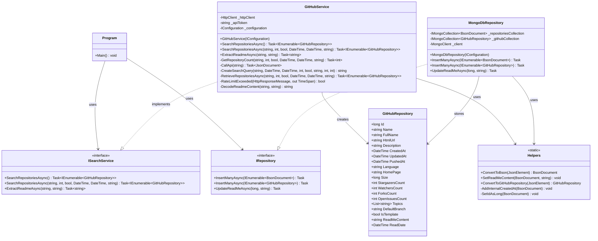

# RepoRanger Class Diagram

This document provides a visual representation of the RepoRanger class structure and relationships.

## Key Relationships

1. **Program** is the entry point that coordinates the application flow:
   - Configures dependency injection
   - Uses ISearchService to find repositories
   - Uses IRepository to store data

2. **GitHubService** implements the ISearchService interface:
   - Handles GitHub API communication
   - Searches for repositories based on criteria
   - Extracts README content
   - Manages API rate limiting

3. **MongoDbRepository** implements the IRepository interface:
   - Connects to MongoDB
   - Stores repository data
   - Updates repositories with README content

4. **Helpers** provides utility methods:
   - Converts between JSON and BSON formats
   - Transforms API responses to domain objects
   - Handles type conversions for database storage

5. **GitHubRepository** is the core domain model:
   - Represents GitHub repository data
   - Stores metadata and README content
