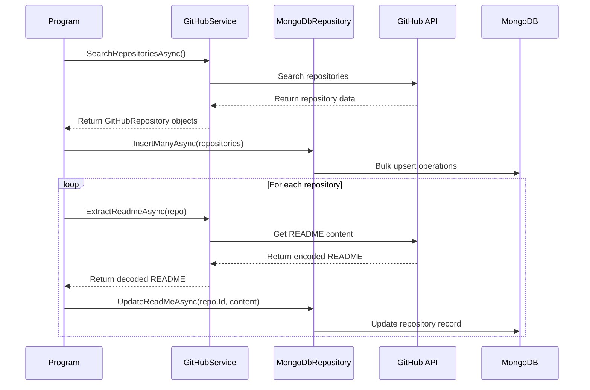

# RepoRanger Technical Guide

This guide documents the technical aspects of the RepoRanger application, including its workflow, components, and implementation details.

## Architecture Overview

RepoRanger follows a simple three-tier architecture:

1. **Data Access Layer**: MongoDB repository for storing GitHub repository data
2. **Service Layer**: GitHub API service for searching and extracting content
3. **Presentation Layer**: Command-line interface for user interaction

## Application Workflow



## GitHub API Integration

RepoRanger integrates with the GitHub REST API to search for repositories and extract README content. Key features of the integration include:

1. **Search Pagination**: Handles pagination to retrieve all search results
2. **Rate Limit Management**: Detects and respects GitHub API rate limits
3. **Large Result Sets**: Uses recursive date-range splitting to handle searches with more than 1000 results 
4. **Content Extraction**: Extracts and decodes base64-encoded README content

### Search Query Construction

The search query is constructed using multiple parameters:

- Keywords for text search
- Star count minimum threshold
- Creation date range
- Language filter
- Fork inclusion/exclusion

Example query:
```
q=fluentcms+archived:false+is:public+in:name,description,readme,topics+created:2019-01-01..2025-03-08+stars:>=10+fork:false+language:C#&sort=star&order=desc
```

### API Rate Limit Handling

GitHub API has rate limits that could impact the application. The service:

1. Checks the remaining rate limit in response headers
2. Automatically waits when the limit is about to be reached
3. Calculates the wait time based on the reset timestamp
4. Resumes operation after the rate limit has reset

## MongoDB Integration

The application uses MongoDB to store repository data. Key features include:

1. **Bulk Operations**: Uses bulk write operations for efficiency
2. **Upsert Semantics**: Prevents duplicate repositories through upsert operations
3. **Type Handling**: Ensures consistent storage of ID fields as Int64

### Collection Structure

Repositories are stored with the following structure:

- Repository metadata (id, name, stars, etc.)
- README content
- Internal metadata (creation timestamp)

### Performance Considerations

- Bulk writes are used to minimize database round-trips
- Updates are targeted to specific fields rather than replacing entire documents
- Error handling for database operations prevents application crashes

## Error Handling

The application implements robust error handling:

1. **API Errors**: Handles GitHub API errors gracefully
2. **Database Errors**: Logs database errors without crashing
3. **Content Parsing**: Handles missing or malformed content
4. **Configuration Validation**: Validates required configuration settings

## Configuration

The application is configured through `appsettings.json`:

```json
{
  "GitHubSettings": {
    "ApiToken": "GITHUB_API_TOKEN",
    "Keywords": "fluentcms",
    "MinStars": 10,
    "ShowForked": false,
    "CreatedFrom": "2019-01-01",
    "CreatedTo": "2025-03-08",
    "Language": "C#"
  },
  "MongoDbSettings": {
    "ConnectionString": "mongodb://localhost:27017",
    "DatabaseName": "RepoRanger",
    "CollectionName": "Repositories"
  }
}
```

## Extensibility Points

The application can be extended in several ways:

1. **Alternative Repository Implementations**: Create new classes that implement `IRepository`
2. **Different Search Services**: Implement `ISearchService` for other code hosting platforms
3. **Additional Content Extraction**: Add methods to extract other repository content

## Future Enhancements

Potential improvements to consider:

1. **Authentication Strategies**: Support for different authentication methods
2. **Parallel Processing**: Process repositories in parallel for better performance
3. **Search Refinement**: Additional search criteria and filters
4. **Content Analysis**: Analyze README content for additional insights
